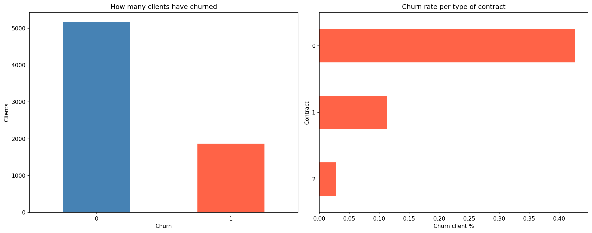
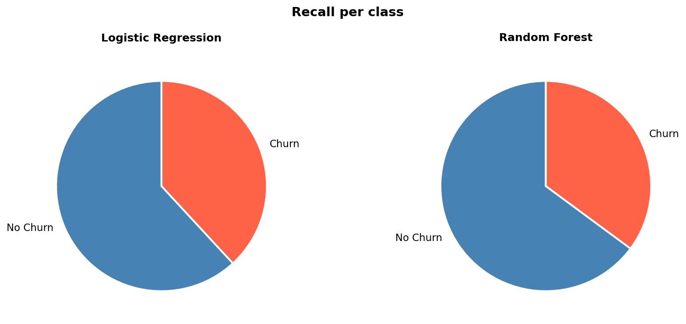
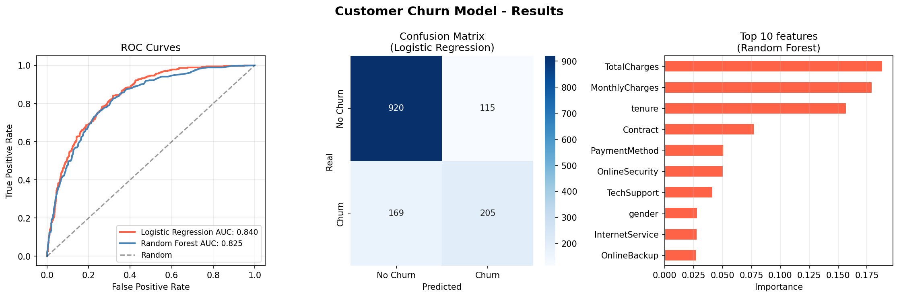

# 📉 Customer Churn Prediction

> Predicting which telecom customers are likely to leave — using Machine Learning


---

## 🎯 Project Overview

Customer churn is one of the major challenges for companies, as losing customers directly impacts revenue and therefore the growth of any organization. This project builds an end-to-end Machine Learning pipeline to identify customers and patterns that are likely to churn so the company can take proactive retention actions.

**Business Question:** *Given a customer's demographics, contract type, and usage behavior — will they churn?*

---

## 📊 Results

| Model | AUC Score |
|---|---|
| **Logistic Regression** | **0.840** ✅ |
| Random Forest | 0.825 |

> Best model: **Logistic Regression** with AUC of 0.840

### Confusion Matrix — Logistic Regression

| | Predicted: No Churn | Predicted: Churn |
|---|---|---|
| **Actual: No Churn** | 920 ✅ | 115 ❌ |
| **Actual: Churn** | 169 ❌ | 205 ✅ |

### Recall Comparison

| Model | Churners Detected | Churners Missed |
|---|---|---|
| **Logistic Regression** | **55%** | 45% |
| Random Forest | 49% | 51% |

> Logistic Regression identified **6.1% more** churners than Random Forest — translating to ~61 additional retained customers per 1,000 at-risk clients.

---

## 🔍 Key Insights

- 📌 **TotalCharges** is the strongest predictor — customers with higher cumulative payments tend to stay longer
- 📌 **MonthlyCharges** — customers paying more per month are at higher risk of leaving
- 📌 **Tenure** — the longer a customer has been with the company, the less likely they are to churn
- 📌 **Contract type** — month-to-month customers churn at roughly 3x the rate of annual contract customers

---

## 💡 Why Recall Matters Most Here

In churn prediction, a **false negative** (missing a customer who is about to leave) is far more costly than a false positive (flagging a customer who would have stayed). Recall directly measures how many actual churners the model identifies — making it the primary business metric for this problem.

From a business perspective:
- Logistic Regression would identify roughly **548 out of every 1,000 churners**
- Random Forest would identify roughly **487 out of every 1,000 churners**

For larger companies, this difference could represent **hundreds of retained customers and significant revenue savings.**

---

## 📈 Visualizations





---

## 🗂️ Project Structure

```
churn-prediction/
│
├── churn_prediction.ipynb    # Full ML pipeline — Google Colab notebook
├── churn_analysis.png        # EDA: churn distribution & contract analysis
├── recall_comparison.png     # Recall pie charts per model
├── churn_results.png         # ROC curves, Confusion Matrix & Feature Importance
├── requirements.txt
└── README.md
```

---

## 🚀 How to Run

### 1. Open in Google Colab
[](https://colab.research.google.com/)

### 2. The dataset loads automatically
No manual download needed — the notebook fetches it directly:

```python
url = "https://raw.githubusercontent.com/IBM/telco-customer-churn-on-icp4d/master/data/Telco-Customer-Churn.csv"
df = pd.read_csv(url)
```

### 3. Run all cells in order
Each section is clearly commented and explained with markdown context.

---

## 🛠️ Tech Stack

- **Python 3.8+**
- **pandas** — data loading and manipulation
- **scikit-learn** — ML models, preprocessing, and evaluation
- **matplotlib / seaborn** — visualizations
- **numpy** — numerical operations

---

## 🧠 ML Pipeline

```
1. Load Data       → IBM Telco Customer Churn (7,043 customers, 21 features)
2. EDA             → Churn distribution, contract type analysis
3. Preprocessing   → Fix TotalCharges dtype, encode categoricals, scale features
4. Train Models    → Logistic Regression & Random Forest
5. Evaluate        → AUC-ROC, Recall, Confusion Matrix, Classification Report
6. Visualize       → ROC curves, Recall pie charts, Feature Importance
```

---

## 🔮 Future Improvements

- Hyperparameter tuning with `GridSearchCV`
- Address class imbalance with **SMOTE**
- Experiment with **XGBoost** or **LightGBM**
- Deploy the model as a web application or API for real-time predictions

---

## 📚 Dataset

**IBM Telco Customer Churn Dataset**
- Records: 7,043 customers
- Features: 21 (demographics, services, billing, contract info)
- Target: `Churn` (Yes / No) — 26.5% churn rate
- Source: [IBM Sample Dataset via Kaggle](https://www.kaggle.com/datasets/blastchar/telco-customer-churn)

---

## 🧠 What I Learned

- Building a complete end-to-end ML pipeline from scratch
- Handling real-world data issues (mixed data types, missing values hidden as whitespace)
- Encoding categorical variables with `LabelEncoder`
- Understanding class imbalance in binary classification problems
- Choosing **Recall** over Accuracy as the primary metric for churn use cases
- Translating ML results into actionable business insights

---

## 👤 Author

**Elaman Ulloa**
[](https://github.com/Elaman142)
[](https://www.linkedin.com/in/elaman-ulloa-a5765b263/)

---

*Built as part of my Data Science portfolio — guided by the Matsuo Lab ML program*
